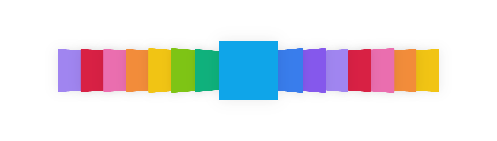

### 概要

2025年 個人制作  
複数のアルバムジャケットやカードのような要素を、奥行き方向に傾いて表示させながら横方向に並べてスクロールアニメーションさせることができます。  
[デモ](https://kanaaa224.github.io/coverflow-js)



### 特徴

・画像やdiv、テキストといった任意の要素を表示可能  
・ループ可能（無限スクロール）  
・両端の自動フェードイン/フェードアウト

### 使うには

以下のサンプルコードのように設定して使います。（空のhtmlにそのままペーストすると、実際に動かせます）

``` html
<script type="module">
    import CoverFlow from 'https://cdn.jsdelivr.net/gh/kanaaa224/coverflow-js@master/dist/coverflow.js';


    // --------------------------------------------------
    //  カバーフローで表示させたい要素を生成
    // --------------------------------------------------

    const colors = [ '#0ea5e9', '#3b82f6', '#8b5cf6', '#a78bfa', '#e11d48', '#f472b6', '#fb923c', '#facc15', '#84cc16', '#10b981' ];

    const size = 200;

    const items = Array.from({ length: 50 }, (_, i) => {
        const e = document.createElement('div');

        e.style.inlineSize      = `${size}px`;
        e.style.blockSize       = `${size}px`;
        e.style.backgroundColor = colors[i % colors.length];
        e.style.aspectRatio     = '1 / 1';

        e.style.borderRadius = '.25rem';
        e.style.boxShadow    = '0 0 3rem 0 #0000001a';
        e.style.cursor       = 'pointer';

        e.style.display        = 'flex';
        e.style.justifyContent = 'center';
        e.style.alignItems     = 'center';

        e.innerHTML = `<p style="opacity: .25; font-weight: bold;">${i + 1}</p>`;

        e.onclick = () => {
            console.log(`[ CoverFlow ] clicked: ${i + 1}`);
        };

        e.updatable = true; // クリックイベントを起こすかどうか（クリックされたときに自動で中央に移動するかどうか）

        return e;
    });


    // --------------------------------------------------
    //  カバーフローのインスタンスを作り、bodyへアタッチ
    // --------------------------------------------------

    const coverFlow = new CoverFlow(items, true, Math.floor(window.innerWidth / size) - 1); // 引数: 各要素の入った配列, ループさせるかどうか, 表示範囲の指定

    coverFlow
        .attach(document.body) // bodyの中にカバーフローの本体となる要素を生成（親要素の指定）
        .update();             // 引数は「中央に表示させたい要素の指定（整数）」ですが、初回は省略してデフォルト引数のthis.index（このときは初期値で0）で初期化を行います

    document.body.style = `
        position: absolute;

        inline-size: 100%; block-size: 100%; margin: 0;

        display: flex; justify-content: center; align-items: center;

        overflow: hidden;
    `;


    // --------------------------------------------------
    //  操作系のイベントを登録
    // --------------------------------------------------

    window.addEventListener('wheel', (e) => {
        coverFlow.update(e.deltaY > 0 ? coverFlow.index + 1 : e.deltaY < 0 ? coverFlow.index - 1 : coverFlow.index);
    }, { passive: true });

    window.addEventListener('keydown', e => {
        coverFlow.update(e.key === 'ArrowRight' ? coverFlow.index + 1 : e.key === 'ArrowLeft' ? coverFlow.index - 1 : coverFlow.index);

        if(e.key === 'D') coverFlow.destroy();
        if(e.key === 'A') coverFlow.attach(document.body).update();
    });

    let x = 0;

    window.addEventListener('touchstart', e => {
        x = e.changedTouches[0].clientX;
    }, { passive: true });

    window.addEventListener('touchend', e => {
        const diff = e.changedTouches[0].clientX - x;

        coverFlow.update(diff < -50 ? coverFlow.index + 1 : diff > 50 ? coverFlow.index - 1 : coverFlow.index);
    }, { passive: true });
</script>
```